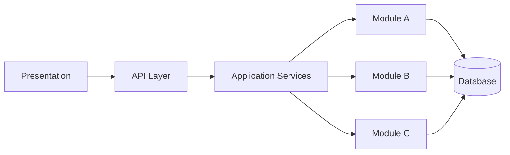
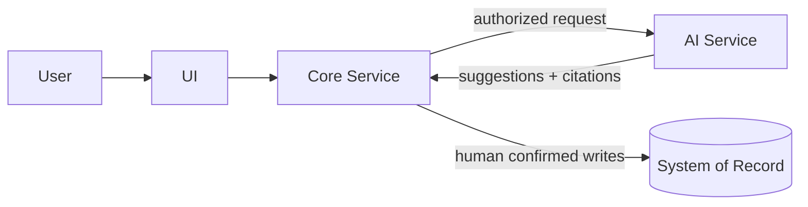
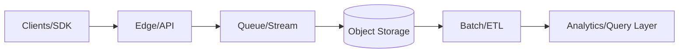

# saad-khan

I design and lead delivery of <b>cloud-native platforms</b>, <b>AI systems</b>, and <b>enterprise architectures</b> — with strong emphasis on <b>modularity</b>, <b>governance</b>, <b>security</b>, and <b>operational excellence</b>.

<a href="#-architecture-portfolio">Architecture Portfolio</a> •
<a href="#-ai-assisted-engineering">AI-Assisted Engineering</a> •
<a href="#-architecture-snapshots">Architecture Snapshots</a> •
<a href="#-writing--playbooks">Writing</a> •
<a href="#-connect">Connect</a>

---

## 🔭 What I work on

- **Software & Solutions Architecture** (platform design, system boundaries, delivery strategy)
- **Cloud Platforms & DevOps** (AWS and GCP, IaC, CI/CD, observability)
- **AI Systems Engineering** (RAG, orchestration, governance, compliance-safe AI)
- **Engineering Enablement** (AI-assisted SDLC workflows, quality gates, repeatable delivery)

---

## 🧱 Architecture Portfolio

These repositories focus on **architecture-first engineering**. They are designed to be public-safe: patterns, diagrams, playbooks, and sanitized examples.

### ✅ Flagship (live)
- **AI-Assisted Engineering Playbook — Agentic Software Engineering Framework**  
  A repeatable operating model for AI-assisted development (Cursor, Claude, OpenAI, Antigravity), built for speed without losing architecture or quality.  
  👉 https://github.com/SD-Khan/ai-assisted-engineering-playbook

### 🧩 Coming next (architecture repos we will add)
- Modular monolith → microservices playbook
- Event tracking pipeline architecture (cloud-native)
- Multi-tenant RBAC SaaS architecture (auditability + compliance + AI boundaries)

---

## 🤖 AI-Assisted Engineering

I treat AI as an **engineering capability layer** inside a controlled system — not an uncontrolled code generator.

Principles:
- Architecture decisions are **human-led**
- AI output is **reviewed and verified**
- Work is decomposed into **small, testable tasks**
- Governance and consistency checks prevent drift
- Debugging and incidents follow evidence-driven workflows

Start here:
👉 https://github.com/SD-Khan/ai-assisted-engineering-playbook

---

## 🗺 Architecture Snapshots

Below are representative high-level patterns I use frequently. More detailed diagrams live in the architecture repos.

### 1) Modular monolith with strict module boundaries

### 2) AI service boundary (suggestion-first + governance)

### 3) Event pipeline reference architecture (cloud-native)

---

## ✍️ Writing & Playbooks

I publish:
- engineering playbooks
- architecture patterns
- governance and quality workflows
- AI-assisted SDLC practices

Current:
- **AI-Assisted Engineering Playbook**  
  https://github.com/SD-Khan/ai-assisted-engineering-playbook

---

## 📈 GitHub Stats

  

---

## 🐍 Contribution Snake (enable once workflow is added)

  

> This requires adding the snake GitHub Action workflow and enabling the `output` branch.

---

## 🤝 Connect

- Email: saad.khan5891@gmail.com
- LinkedIn: add-your-link-here

